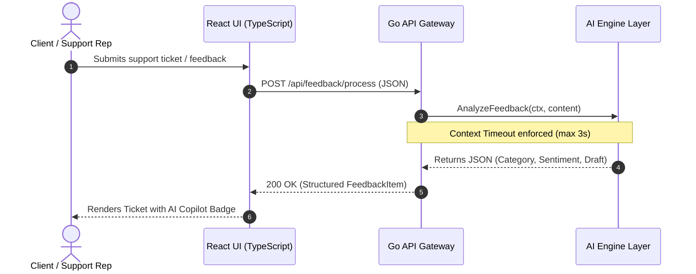

# Full-Stack AI Feedback Intelligence Engine

A high-performance Full-Stack platform designed for real-time customer feedback analysis, automated ticket classification, and AI-driven response generation. Built for scale, concurrency, and robust LLM orchestration.

---

## Architecture & System Design

The application follows a clean micro-service architecture: a high-throughput **Go Backend** serving a lightweight **React/TypeScript UI**, with strict context-driven timeouts to handle asynchronous AI inference.

## Key Features

High-Throughput Ingestion: Go-powered backend handling incoming HTTP payloads with minimal memory overhead.

LLM Guardrails & Resilience: Non-blocking context cancellation (context.WithTimeout) prevents slow third-party AI APIs from stalling HTTP threads.

Type-Safe Contract: End-to-end type alignment between Go struct schemas and TypeScript interfaces.

Interactive AI Copilot UI: Clean React interface displaying automated sentiment badges (Positive/Negative/Neutral) and instant AI response drafts.

Production-Ready Tooling: Fully containerized with Docker Compose, clean Make targets, and automated GitHub Actions CI testing.

 ## Tech Stack

Backend: Go 1.22 (Standard net/http, Go Routines, Channels, Context API)
Frontend: React 18, TypeScript 5, Vite
Storage & Ops: PostgreSQL 15, Docker & Docker Compose
Quality Assurance: Go testing package, GitHub Actions CI

## Project Structure

## API Endpoint Reference
POST /api/feedback/process

Processes customer raw text input, runs AI analysis, and returns a structured response.
Request Body
JSON

    {
      "customer": "jane.doe@example.com",
      "content": "The new export feature works really well, but I need faster loading speeds."
    }

Response Body (200 OK)
JSON

    {
      "id": "fb_102",
      "customer": "jane.doe@example.com",
      "content": "The new export feature works really well, but I need faster loading speeds.",
      "category": "Feature Request",
      "sentiment": "POSITIVE",
      "ai_suggestion": "Thanks for the feedback regarding 'The new export feature works really well, but I need faster loading speeds.'! We added this to our roadmap.",
      "created_at": "2026-10-09T14:30:00Z"
    }

## Quick Start (Local Development)
Prerequisites

  Docker & Docker Compose installed
  Go 1.22+ (optional, for local non-docker development)
  Node.js 18+ (optional)

1. Run via Docker Compose

  Clone the repository and start all services with a single command:
  Bash
  
    git clone [https://github.com/dein-username/fullstack-ai-feedback-engine.git](https://github.com/dein-username/fullstack-ai-feedback-engine.git)
    cd fullstack-ai-feedback-engine
    
    # Build and start services in detached mode
    docker-compose up --build -d
  
  Access the application:

  Frontend UI: http://localhost:3000
  Go Backend API: http://localhost:8080

2. Run Tests

  To execute unit tests across the backend Go packages:
  
    make test-backend
    # or manually:
    cd backend && go test ./... -v
  

## License

This project is licensed under the MIT License.
